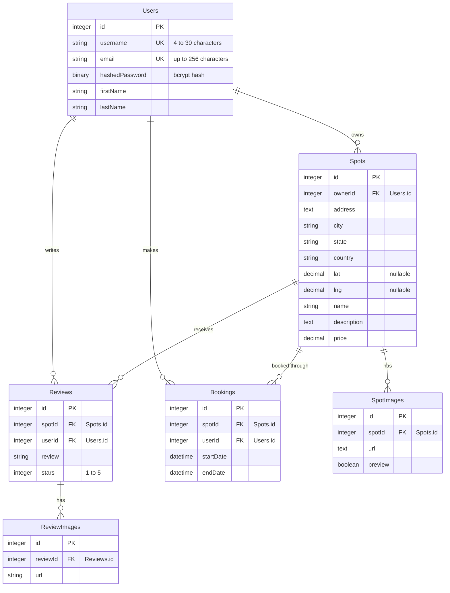

# BobaBnB

BobaBnB is a full-stack, Airbnb-style web app for boba shops. You can browse "spots", look at their photos and reviews, list your own spot, and review other people's.

**Live site:** https://joshua-auth-me.onrender.com

To look around without signing up, open the profile menu in the top right, choose **Log In**, then click **DemoUser Login**. The site runs on Render's free tier, so the first request after it has been idle can take up to a minute.

## Contents

- [Features](#features)
- [Tech stack](#tech-stack)
- [Getting started](#getting-started)
- [Environment variables](#environment-variables)
- [Scripts](#scripts)
- [Deployment](#deployment)
- [Database schema](#database-schema)
- [Project structure](#project-structure)
- [API reference](#api-reference)
- [Roadmap](#roadmap)
- [Author](#author)

## Features

In the app today:

- **Accounts:** sign up, log in with a username or email, log out, or use the one-click demo login.
- **Browse spots:** the home page shows every spot's preview image, city and state, average rating ("New" if it has no reviews) and nightly price.
- **Spot details:** a photo gallery (a preview image plus up to four more), the host's name, the description, a rating summary and all reviews.
- **Host a spot:** create a spot with a preview image and up to four extra photos, then update or delete it from **Manage Spots**.
- **Reviews:** leave a 1–5 star review on any spot you don't own (one per spot), and delete your own reviews.

Supported by the API but not in the UI yet:

- Bookings: create, list, change dates and cancel. The **Reserve Now** button on a spot's page is a placeholder for now.
- Adding and removing spot images after a spot is created, and review images.
- Filtering spots by price and location, and paginating results.
- Editing a review.

Frontend routes:

| Path | Page |
| --- | --- |
| `/` | All spots |
| `/spots/:spotId` | Spot details and reviews |
| `/spots/new` | Create a spot |
| `/spots/current` | Manage your spots |
| `/spots/:spotId/edit` | Update a spot |

## Tech stack

| Layer | Tools |
| --- | --- |
| Frontend | React 18, Redux 4 with redux-thunk, React Router 5, Create React App (react-scripts 5) |
| Backend | Node.js, Express 4, Sequelize 6 and sequelize-cli, express-validator |
| Auth and security | JWT in an httpOnly cookie (jsonwebtoken), bcryptjs, csurf, helmet |
| Database | SQLite in development, PostgreSQL in production |
| Hosting | Render |

## Getting started

### Prerequisites

- Node.js 18 and npm

### 1. Clone and install

```bash
git clone https://github.com/jhoang304/Bobabnb.git
cd Bobabnb
npm install --prefix backend
npm install --prefix frontend
```

### 2. Configure the backend

```bash
cp backend/.env.example backend/.env
```

The defaults in [`backend/.env.example`](backend/.env.example) work for local development as they are. See [Environment variables](#environment-variables) for what each value does.

### 3. Create and seed the database

```bash
cd backend
npx dotenv sequelize db:migrate
npx dotenv sequelize db:seed:all
```

This creates a SQLite file at `backend/db/dev.db` with 7 users, 16 spots, and sample images, reviews and bookings. `npx dotenv` loads `backend/.env` before running the Sequelize CLI.

To start over with fresh seed data, delete `backend/db/dev.db` and run both commands again.

### 4. Start the servers

Use two terminals:

```bash
# Terminal 1: API on http://localhost:8000, restarts on changes (nodemon)
cd backend
npm start
```

```bash
# Terminal 2: React dev server on http://localhost:3000
cd frontend
npm start
```

Open http://localhost:3000. The React dev server proxies `/api` requests to `http://localhost:8000` (the `proxy` field in `frontend/package.json`), so keep `PORT=8000` or update the proxy to match.

### Demo accounts

| Username | Email | Password |
| --- | --- | --- |
| `Demo-lition` | `demo@user.io` | `password` |
| `FakeUser1` | `user1@user.io` | `password2` |

More seeded users are in [`backend/db/seeders/20230608202943-demo-user.js`](backend/db/seeders/20230608202943-demo-user.js).

## Environment variables

The backend reads these from `backend/.env` in development and from the host's environment in production.

| Variable | Needed in | Purpose | Example |
| --- | --- | --- | --- |
| `PORT` | both | Port the Express server listens on. Defaults to `8000`. | `8000` |
| `DB_FILE` | development | Path to the SQLite database, relative to `backend/`. | `db/dev.db` |
| `JWT_SECRET` | both | Secret used to sign session tokens. Use a long random string in production. | `change-me` |
| `JWT_EXPIRES_IN` | both | Session length in seconds, also used as the cookie's max age. Logging in fails if it is missing. | `604800` (one week) |
| `SCHEMA` | production | PostgreSQL schema that holds the app's tables. | `bobabnb_schema` |
| `DATABASE_URL` | production | PostgreSQL connection string. | |
| `NODE_ENV` | production | Set to `production` to switch to PostgreSQL, serve the React build and use secure cookies. Leave it unset locally. | `production` |

## Scripts

| Where | Command | What it does |
| --- | --- | --- |
| `backend/` | `npm start` | Runs `nodemon ./bin/www` in development, or `node ./bin/www` when `NODE_ENV=production` |
| `backend/` | `npx dotenv sequelize <command>` | Runs a Sequelize CLI command (`db:migrate`, `db:seed:all`, `db:migrate:undo:all`, ...) with `.env` loaded |
| `backend/` | `npm run build` | Creates the PostgreSQL schema named by `SCHEMA` if it doesn't exist (production only) |
| `backend/` | `npm test` | Runs the backend unit tests (`*.test.js`) with Node's built-in test runner |
| `frontend/` | `npm start` | Starts the React dev server |
| `frontend/` | `npm run build` | Builds the React app into `frontend/build` |
| root | `npm install` | Installs backend and frontend dependencies (used by the Render build) |
| root | `npm run render-postbuild` | Builds the React app |
| root | `npm run build` | Runs the backend `build` script |
| root | `npm start` | Starts the backend. In production it also serves the React build. |

The root `dev:backend` and `dev:frontend` scripts don't work yet ([#18](https://github.com/jhoang304/Bobabnb/issues/18)). Run `npm start` inside `backend/` and `frontend/` instead.

## Deployment

The live site is a single Render web service. The Express server serves both the API and the built React app. Deploy settings live in the Render dashboard. There is no `render.yaml` in the repo.

- **Build command:**

  ```bash
  npm install && npm run render-postbuild && npm run build && npm run sequelize --prefix backend db:migrate && npm run sequelize --prefix backend db:seed:all
  ```

- **Start command:** `npm start`
- **Environment:** `NODE_ENV=production`, `DATABASE_URL`, `SCHEMA`, `JWT_SECRET`, `JWT_EXPIRES_IN`

Sequelize records which migrations and seeders have run (in the `SequelizeMeta` and `SequelizeData` tables), so redeploying keeps existing data and doesn't re-seed. Don't add `db:seed:undo:all` or `db:migrate:undo:all` to the build command, because they erase every user-created spot and review on each deploy.

To reset production to fresh seed data, run the following from the Render shell. The seeders refer to rows by fixed ids, so the tables have to be dropped and recreated, not just emptied. This deletes all data.

```bash
npm run sequelize --prefix backend db:seed:undo:all
npm run sequelize --prefix backend db:migrate:undo:all
npm run sequelize --prefix backend db:migrate
npm run sequelize --prefix backend db:seed:all
```

## Database schema



Every table also has `createdAt` and `updatedAt` timestamps. Only `SpotImages.spotId` and `Reviews.spotId` are foreign keys in the database itself (with `ON DELETE CASCADE`). The other relationships exist only as Sequelize associations ([#21](https://github.com/jhoang304/Bobabnb/issues/21)). The migrations are in [`backend/db/migrations`](backend/db/migrations).

## Project structure

```
Bobabnb/
├── package.json          # root scripts used by Render
├── backend/
│   ├── app.js            # Express app: middleware, CSRF, error handlers
│   ├── bin/www           # entry point: loads .env, checks the DB connection, starts the server
│   ├── config/           # environment config and Sequelize connection settings
│   ├── db/
│   │   ├── migrations/
│   │   ├── models/
│   │   └── seeders/
│   ├── routes/
│   │   ├── index.js      # mounts /api, CSRF restore route, serves the React build in production
│   │   └── api/          # session, users, spots, reviews, bookings, spot-images, review-images
│   └── utils/            # JWT cookie auth and validation helpers
└── frontend/
    ├── public/
    └── src/
        ├── App.js        # routes
        ├── components/   # one folder per page or modal
        ├── context/      # modal provider
        └── store/        # Redux slices (session, spot, review) and csrfFetch
```

## API reference

All endpoints are under `/api`, and requests and responses are JSON.

### Authentication and CSRF

Logging in or signing up sets an httpOnly `token` cookie that holds a JWT. The cookie lasts `JWT_EXPIRES_IN` seconds, and the server reads it on every request.

Every request that isn't a `GET` also needs a CSRF token. Send the value of the `XSRF-TOKEN` cookie back in an `XSRF-Token` header. In development, call `GET /api/csrf/restore` to get the cookie. In production, the server sets it when it serves the page. In the frontend, `csrfFetch` in [`frontend/src/store/csrf.js`](frontend/src/store/csrf.js) handles this.

Example against the local server:

```bash
# Get the CSRF cookies
curl -c cookies.txt http://localhost:8000/api/csrf/restore

# Log in as the demo user, using the XSRF-TOKEN value from cookies.txt
curl -b cookies.txt -c cookies.txt -X POST http://localhost:8000/api/session \
  -H "Content-Type: application/json" \
  -H "XSRF-Token: <XSRF-TOKEN value>" \
  -d '{"credential": "Demo-lition", "password": "password"}'
```

### Errors

Errors come in two shapes.

Errors raised by middleware (authentication, login and signup validation, database validation, unknown routes) include a `title` and a `stack`. `stack` is `null` in production.

```json
{
  "title": "Authentication required",
  "message": "Authentication required",
  "errors": { "message": "Authentication required" },
  "stack": "Error: Authentication required ..."
}
```

Errors returned by route handlers only have a `message`, plus an `errors` object keyed by field when validation fails:

```json
{ "message": "Spot couldn't be found" }
```

Every endpoint marked as requiring auth returns the `401` above when you're logged out. Endpoints that need you to own the resource return `403` with a message specific to that endpoint.

### Data types

- Timestamps and booking dates are ISO 8601 strings, for example `"2030-01-01T00:00:00.000Z"`.
- `lat`, `lng` and `price` are `DECIMAL` columns. SQLite (local) returns them as numbers, and PostgreSQL (production) returns them as strings, for example `"price": "67"`.

### Endpoints

| Method | Path | Auth | Description |
| --- | --- | --- | --- |
| `GET` | `/api/session` | | [Get the current user](#get-the-current-user) |
| `POST` | `/api/session` | | [Log in](#log-in) |
| `DELETE` | `/api/session` | | [Log out](#log-out) |
| `POST` | `/api/users` | | [Sign up](#sign-up) |
| `GET` | `/api/csrf/restore` | | [Get a CSRF token](#get-a-csrf-token) (development only) |
| `GET` | `/api/spots` | | [Get all spots](#get-all-spots) |
| `GET` | `/api/spots/current` | Yes | [Get your spots](#get-your-spots) |
| `GET` | `/api/spots/:spotId` | | [Get spot details](#get-spot-details) |
| `POST` | `/api/spots` | Yes | [Create a spot](#create-a-spot) |
| `PUT` | `/api/spots/:spotId` | Owner | [Edit a spot](#edit-a-spot) |
| `DELETE` | `/api/spots/:spotId` | Owner | [Delete a spot](#delete-a-spot) |
| `POST` | `/api/spots/:spotId/images` | Owner | [Add an image to a spot](#add-an-image-to-a-spot) |
| `DELETE` | `/api/spot-images/:imageId` | Owner | [Delete a spot image](#delete-a-spot-image) |
| `GET` | `/api/spots/:spotId/reviews` | | [Get reviews for a spot](#get-reviews-for-a-spot) |
| `GET` | `/api/reviews/current` | Yes | [Get your reviews](#get-your-reviews) |
| `POST` | `/api/spots/:spotId/reviews` | Yes | [Create a review](#create-a-review) |
| `PUT` | `/api/reviews/:reviewId` | Author | [Edit a review](#edit-a-review) |
| `DELETE` | `/api/reviews/:reviewId` | Author | [Delete a review](#delete-a-review) |
| `POST` | `/api/reviews/:reviewId/images` | Author | [Add an image to a review](#add-an-image-to-a-review) |
| `DELETE` | `/api/review-images/:imageId` | Author | [Delete a review image](#delete-a-review-image) |
| `GET` | `/api/bookings/current` | Yes | [Get your bookings](#get-your-bookings) |
| `GET` | `/api/spots/:spotId/bookings` | Yes | [Get bookings for a spot](#get-bookings-for-a-spot) |
| `POST` | `/api/spots/:spotId/bookings` | Yes, not the owner | [Create a booking](#create-a-booking) |
| `PUT` | `/api/bookings/:bookingId` | Booker | [Edit a booking](#edit-a-booking) |
| `DELETE` | `/api/bookings/:bookingId` | Booker or host | [Delete a booking](#delete-a-booking) |

### Session and users

#### Get the current user

`GET /api/session`

Returns `200` with the logged-in user, or `{ "user": null }` if nobody is logged in.

```json
{
  "user": {
    "id": 1,
    "firstName": "Harper",
    "lastName": "Mitchell",
    "email": "demo@user.io",
    "username": "Demo-lition"
  }
}
```

#### Log in

`POST /api/session`

`credential` can be a username or an email.

```json
{
  "credential": "Demo-lition",
  "password": "password"
}
```

Returns `200` with `{ "user": { ... } }` in the same shape as [Get the current user](#get-the-current-user), and sets the `token` cookie.

| Status | When | Body |
| --- | --- | --- |
| `400` | `credential` or `password` is missing | `"errors": { "credential": "Please provide a valid email or username.", "password": "Please provide a password." }` |
| `401` | Wrong username, email or password | `"errors": { "credential": "The provided credentials were invalid." }` |

#### Log out

`DELETE /api/session`

Clears the `token` cookie and returns `200` with `{ "message": "success" }`.

#### Sign up

`POST /api/users`

```json
{
  "firstName": "Harper",
  "lastName": "Mitchell",
  "email": "harper@example.com",
  "username": "HarperM",
  "password": "secret password"
}
```

Returns `200` with `{ "user": { ... } }` and logs the new user in.

| Status | When | Body |
| --- | --- | --- |
| `400` | Invalid email, username shorter than 4 characters or shaped like an email, or password shorter than 6 characters | `"errors": { "email": "Please provide a valid email.", "username": "Please provide a username with at least 4 characters.", "password": "Password must be 6 characters or more." }` |
| `500` | Email or username is already taken | `"title": "Validation error", "errors": { "email": "email must be unique" }` |
| `500` | `firstName` or `lastName` is missing | `"errors": { "firstName": "User.firstName cannot be null" }` |
| `500` | `firstName` or `lastName` has anything other than letters, including spaces, hyphens and apostrophes | `"errors": { "firstName": "Validation isAlpha on firstName failed" }` |

These `500` responses should be `4xx` errors ([#14](https://github.com/jhoang304/Bobabnb/issues/14)).

#### Get a CSRF token

`GET /api/csrf/restore`

Development only. Sets the `XSRF-TOKEN` cookie and returns `201` with `{}`.

### Spots

#### Get all spots

`GET /api/spots`

Optional query parameters:

| Parameter | Type | Default |
| --- | --- | --- |
| `page` | integer, 1 or more | `1` |
| `size` | integer, 1 or more | `20` |
| `minLat`, `maxLat`, `minLng`, `maxLng` | decimal | |
| `minPrice`, `maxPrice` | decimal, 0 or more | |

Returns `200`:

```json
{
  "Spots": [
    {
      "id": 1,
      "ownerId": 1,
      "address": "5315 Cypress Creek Pkwy C",
      "city": "Houston",
      "state": "Texas",
      "country": "United States of America",
      "lat": 29.9548,
      "lng": -95.434,
      "name": "Teahouse",
      "description": "Traditional tea flavors and recipes from a brand built over two decades.",
      "price": 67,
      "createdAt": "2026-09-12T21:18:45.563Z",
      "updatedAt": "2026-09-12T21:18:45.563Z",
      "avgRating": 4,
      "previewImage": "https://images.unsplash.com/photo-1558857563-b371033873b8?w=1200&q=80"
    }
  ],
  "page": 1,
  "size": 20
}
```

| Status | When | Body |
| --- | --- | --- |
| `400` | A query parameter is invalid | `"message": "Validation error", "errors": { "page": "Page must be greater than or equal to 1", "size": "Size must be greater than or equal to 1", "minLat": "Minimum latitude is invalid", "maxLat": "Maximum latitude is invalid", "minLng": "Minimum longitude is invalid", "maxLng": "Maximum longitude is invalid", "minPrice": "Minimum price must be a decimal greater than or equal to 0", "maxPrice": "Maximum price must be a decimal greater than or equal to 0" }` |

`previewImage` is `null` for a spot with no image marked as its preview.

Current limitations:

- `avgRating` is `0` for a spot with no reviews ([#20](https://github.com/jhoang304/Bobabnb/issues/20)).
- Pagination only applies when `page` is 10 or less and `size` is 20 or less. Outside that range, every matching spot is returned ([#15](https://github.com/jhoang304/Bobabnb/issues/15)).
- `page` and `size` are echoed back as sent, so they are strings when passed in the query string ([#15](https://github.com/jhoang304/Bobabnb/issues/15)).

#### Get your spots

`GET /api/spots/current` · Auth required

Returns `200` with `{ "Spots": [ ... ] }`. Each spot has the same shape as in [Get all spots](#get-all-spots), with no `page` or `size`. A spot with no reviews has `"avgRating": null`, and a spot with no preview image has `"previewImage": "none"` ([#20](https://github.com/jhoang304/Bobabnb/issues/20)).

#### Get spot details

`GET /api/spots/:spotId`

Returns `200` with the spot, its review count and average rating, its images and its owner. `avgStarRating` is `null` when there are no reviews.

```json
{
  "id": 1,
  "ownerId": 1,
  "address": "5315 Cypress Creek Pkwy C",
  "city": "Houston",
  "state": "Texas",
  "country": "United States of America",
  "lat": 29.9548,
  "lng": -95.434,
  "name": "Teahouse",
  "description": "Traditional tea flavors and recipes from a brand built over two decades.",
  "price": 67,
  "createdAt": "2026-09-12T21:18:45.563Z",
  "updatedAt": "2026-09-12T21:18:45.563Z",
  "numReviews": 3,
  "avgStarRating": 4,
  "SpotImages": [
    { "id": 1, "url": "https://images.unsplash.com/photo-1558857563-b371033873b8?w=1200&q=80", "preview": true },
    { "id": 2, "url": "https://images.unsplash.com/photo-1541696490-8744a5dc0228?w=1200&q=80", "preview": false }
  ],
  "Owner": {
    "id": 1,
    "firstName": "Harper",
    "lastName": "Mitchell"
  }
}
```

| Status | When | Body |
| --- | --- | --- |
| `404` | No spot with that id | `{ "message": "Spot couldn't be found" }` |

#### Create a spot

`POST /api/spots` · Auth required

```json
{
  "address": "5315 Cypress Creek Pkwy C",
  "city": "Houston",
  "state": "Texas",
  "country": "United States of America",
  "lat": 29.9548,
  "lng": -95.434,
  "name": "Teahouse",
  "description": "Traditional tea flavors and recipes from a brand built over two decades.",
  "price": 67
}
```

All fields are required. `lat` and `lng` must be numbers, `name` can be at most 50 characters, and `price` must be at least 1. The web forms currently send `40` for both `lat` and `lng` ([#28](https://github.com/jhoang304/Bobabnb/issues/28)).

Returns `201` with the new spot, including `id`, `ownerId`, `createdAt` and `updatedAt`.

| Status | When | Body |
| --- | --- | --- |
| `400` | A field is missing or invalid | `"message": "Bad Request", "errors": { "address": "Street address is required", "city": "City is required", "state": "State is required", "country": "Country is required", "lat": "Latitude is not valid", "lng": "Longitude is not valid", "name": "Name must be less than 50 characters", "description": "Description is required", "price": "Price per day is required" }` |

#### Edit a spot

`PUT /api/spots/:spotId` · Auth required · Owner only

Takes the same body and validation as [Create a spot](#create-a-spot), except that `price` has no minimum. Returns `200` with the updated spot.

| Status | When | Body |
| --- | --- | --- |
| `400` | A field is missing or invalid | Same as [Create a spot](#create-a-spot) |
| `403` | You don't own the spot | `{ "message": "Only the owner can update this spot" }` |
| `404` | No spot with that id | `{ "message": "Spot couldn't be found" }` |

#### Delete a spot

`DELETE /api/spots/:spotId` · Auth required · Owner only

Returns `200` with `{ "message": "Successfully deleted" }`.

| Status | When | Body |
| --- | --- | --- |
| `403` | You don't own the spot | `{ "message": "Only the owner can delete this spot" }` |
| `404` | No spot with that id | `{ "message": "Spot couldn't be found" }` |

#### Add an image to a spot

`POST /api/spots/:spotId/images` · Auth required · Owner only

```json
{
  "url": "https://example.com/teahouse.jpg",
  "preview": true
}
```

Returns `200` with `{ "id": 81, "url": "https://example.com/teahouse.jpg", "preview": true }`.

| Status | When | Body |
| --- | --- | --- |
| `403` | You don't own the spot | `{ "message": "Only the owner can add images to this spot" }` |
| `404` | No spot with that id | `{ "message": "Spot couldn't be found" }` |
| `404` | `url` is missing (should be `400`, [#20](https://github.com/jhoang304/Bobabnb/issues/20)) | `{ "message": "Image is required" }` |

#### Delete a spot image

`DELETE /api/spot-images/:imageId` · Auth required · Spot owner only

Returns `200` with `{ "message": "successfully deleted" }`.

| Status | When | Body |
| --- | --- | --- |
| `403` | You don't own the spot | `{ "message": "Only the user can delete the image of their spot" }` |
| `404` | No image with that id | `{ "message": "Spot Image couldn't be found" }` |

### Reviews

#### Get reviews for a spot

`GET /api/spots/:spotId/reviews`

Returns `200`:

```json
{
  "Reviews": [
    {
      "id": 1,
      "spotId": 3,
      "userId": 1,
      "review": "Their handmade boba is so good, but they put too much ice in their drinks",
      "stars": 4,
      "createdAt": "2026-09-12T21:18:45.563Z",
      "updatedAt": "2026-09-12T21:18:45.563Z",
      "User": { "id": 1, "firstName": "Harper", "lastName": "Mitchell" },
      "ReviewImages": [
        { "id": 1, "url": "https://images.unsplash.com/photo-1558857563-b371033873b8?w=800&q=80" }
      ]
    }
  ]
}
```

| Status | When | Body |
| --- | --- | --- |
| `404` | No spot with that id | `{ "message": "Spot couldn't be found" }` |

#### Get your reviews

`GET /api/reviews/current` · Auth required

Returns `200` with `{ "Reviews": [ ... ] }`, in the same shape as [Get reviews for a spot](#get-reviews-for-a-spot). Each review also has a `Spot` object that leaves out `description`, `createdAt` and `updatedAt` and adds `previewImage` (`"none"` if the spot has no preview image).

#### Create a review

`POST /api/spots/:spotId/reviews` · Auth required

```json
{
  "review": "Great variety of milk teas",
  "stars": 5
}
```

Returns `201` with the new review (`id`, `spotId`, `userId`, `review`, `stars`, `createdAt`, `updatedAt`). You can review a spot only once. Reviews longer than 255 characters fail on PostgreSQL ([#19](https://github.com/jhoang304/Bobabnb/issues/19)).

| Status | When | Body |
| --- | --- | --- |
| `400` | `review` is missing, or `stars` isn't between 1 and 5 | `"message": "Bad Request", "errors": { "reviewError": "Review text is required", "starError": "Stars must be an integer from 1 to 5" }` |
| `404` | No spot with that id | `{ "message": "Spot couldn't be found" }` |
| `500` | You already reviewed this spot | `{ "message": "User already has a review for this spot" }` |

The `400` error keys are `reviewError` and `starError` here, but `review` and `stars` in [Edit a review](#edit-a-review) ([#11](https://github.com/jhoang304/Bobabnb/issues/11)).

#### Edit a review

`PUT /api/reviews/:reviewId` · Auth required · Author only

Takes the same body as [Create a review](#create-a-review) and returns `200` with the updated review.

| Status | When | Body |
| --- | --- | --- |
| `400` | `review` is missing, or `stars` isn't between 1 and 5 | `"message": "Bad Request", "errors": { "review": "Review text is required", "stars": "Stars must be an integer from 1 to 5" }` |
| `403` | You didn't write the review | `{ "message": "Only the owner can update this review" }` |
| `404` | No review with that id | `{ "message": "Review couldn't be found" }` |

#### Delete a review

`DELETE /api/reviews/:reviewId` · Auth required · Author only

Returns `200` with `{ "message": "Successfully deleted" }`.

| Status | When | Body |
| --- | --- | --- |
| `403` | You didn't write the review | `{ "message": "Only the owner can delete this review" }` |
| `404` | No review with that id | `{ "message": "Review couldn't be found" }` |

#### Add an image to a review

`POST /api/reviews/:reviewId/images` · Auth required · Author only

```json
{
  "url": "https://example.com/my-drink.jpg"
}
```

Returns `200` with `{ "id": 13, "url": "https://example.com/my-drink.jpg" }`.

| Status | When | Body |
| --- | --- | --- |
| `403` | You didn't write the review | `{ "message": "Only the owner can add images to this review" }` |
| `403` | The image limit was reached | `{ "message": "Maximum number of images for this resource was reached" }` |
| `404` | No review with that id | `{ "message": "Review couldn't be found" }` |

The limit is meant to be 10 images per review, but it counts every review image in the database, so it always fails once the seed data is loaded ([#9](https://github.com/jhoang304/Bobabnb/issues/9)).

#### Delete a review image

`DELETE /api/review-images/:imageId` · Auth required · Review author only

Returns `200` with `{ "message": "successfully deleted" }`.

| Status | When | Body |
| --- | --- | --- |
| `403` | You didn't write the review | `{ "message": "Only the user can delete the image of their review" }` |
| `404` | No image with that id | `{ "message": "Review Image couldn't be found" }` |

### Bookings

#### Get your bookings

`GET /api/bookings/current` · Auth required

Returns `200`:

```json
{
  "Bookings": [
    {
      "id": 13,
      "spotId": 3,
      "userId": 1,
      "startDate": "2030-01-01T00:00:00.000Z",
      "endDate": "2030-01-05T00:00:00.000Z",
      "createdAt": "2026-09-12T21:18:45.563Z",
      "updatedAt": "2026-09-12T21:18:45.563Z",
      "Spot": {
        "id": 3,
        "ownerId": 2,
        "address": "9889 Bellaire Blvd",
        "city": "Houston",
        "state": "Texas",
        "country": "United States of America",
        "lat": 29.705,
        "lng": -95.5535,
        "name": "Xing Fu Tang",
        "price": 200,
        "previewImage": "https://images.unsplash.com/photo-1756132539966-8d65f7a9eed8?w=1200&q=80"
      }
    }
  ]
}
```

#### Get bookings for a spot

`GET /api/spots/:spotId/bookings` · Auth required

If you don't own the spot, each booking only has its dates:

```json
{
  "Bookings": [
    { "spotId": 3, "startDate": "2030-01-01T00:00:00.000Z", "endDate": "2030-01-05T00:00:00.000Z" }
  ]
}
```

If you own the spot, each booking has every field plus the guest:

```json
{
  "Bookings": [
    {
      "id": 13,
      "spotId": 3,
      "userId": 1,
      "startDate": "2030-01-01T00:00:00.000Z",
      "endDate": "2030-01-05T00:00:00.000Z",
      "createdAt": "2026-09-12T21:18:45.563Z",
      "updatedAt": "2026-09-12T21:18:45.563Z",
      "User": { "id": 1, "firstName": "Harper", "lastName": "Mitchell" }
    }
  ]
}
```

| Status | When | Body |
| --- | --- | --- |
| `404` | No spot with that id | `{ "message": "Spot couldn't be found" }` |

#### Create a booking

`POST /api/spots/:spotId/bookings` · Auth required · Not the spot's owner

```json
{
  "startDate": "2030-01-01",
  "endDate": "2030-01-05"
}
```

Returns `200` with the new booking (`id`, `spotId`, `userId`, `startDate`, `endDate`, `createdAt`, `updatedAt`).

| Status | When | Body |
| --- | --- | --- |
| `400` | A date is missing, isn't a valid date, `startDate` is before today (UTC), or `endDate` is on or before `startDate` | `"message": "Bad Request"`, with `errors.startDate` set to one of `"startDate is required"`, `"startDate must be a valid date"` or `"startDate cannot be in the past"`, and `errors.endDate` set to one of `"endDate is required"`, `"endDate must be a valid date"` or `"endDate cannot be on or before startDate"` |
| `403` | You own the spot | `{ "message": "Owner cannot book their own spot" }` |
| `403` | The dates overlap an existing booking | `"message": "Sorry, this spot is already booked for the specified dates", "errors": { "startDate": "Start date conflicts with an existing booking", "endDate": "End date conflicts with an existing booking" }` |
| `404` | No spot with that id | `{ "message": "Spot couldn't be found" }` |

Both the start and end dates of a booking count as booked, so a new booking can't start on the day another one ends. When the dates overlap, `errors` has `startDate` if the new start falls inside an existing booking and `endDate` if the new end does. If the new dates surround an existing booking, both are set.

#### Edit a booking

`PUT /api/bookings/:bookingId` · Auth required · Booker only

Takes the same body as [Create a booking](#create-a-booking) and returns `200` with the updated booking. The booking's own current dates don't count as a conflict. A booking that has already started can keep its start date, for example to extend its end date, but a new start date can't be in the past.

| Status | When | Body |
| --- | --- | --- |
| `400` | A date is missing or invalid | Same as [Create a booking](#create-a-booking) |
| `403` | You didn't make the booking | `{ "message": "Only the user can edit their booking" }` |
| `403` | The booking's end date has passed | `{ "message": "Past bookings can't be modified" }` |
| `403` | The new dates overlap another booking | Same as [Create a booking](#create-a-booking) |
| `404` | No booking with that id | `{ "message": "Booking couldn't be found" }` |

#### Delete a booking

`DELETE /api/bookings/:bookingId` · Auth required · Booker or spot owner

Returns `200` with `{ "message": "Successfully deleted" }`.

| Status | When | Body |
| --- | --- | --- |
| `403` | The booking has already started | `{ "message": "Bookings that have been started can't be deleted" }` |
| `403` | You didn't make the booking and don't own the spot | `{ "message": "Booking must belong to the current user or the Spot must belong to the current user" }` |
| `404` | No booking with that id | `{ "message": "Booking couldn't be found" }` |

## Roadmap

Planned features:

- Booking flow and a Manage Bookings page ([#33](https://github.com/jhoang304/Bobabnb/issues/33))
- Search, filters and pagination on the home page ([#34](https://github.com/jhoang304/Bobabnb/issues/34))
- Manage Reviews page and user profile ([#35](https://github.com/jhoang304/Bobabnb/issues/35))
- Managing spot images on the Update Spot page ([#36](https://github.com/jhoang304/Bobabnb/issues/36))
- Review photos ([#37](https://github.com/jhoang304/Bobabnb/issues/37))
- Map view of spots ([#38](https://github.com/jhoang304/Bobabnb/issues/38))
- Uploading images instead of pasting URLs ([#39](https://github.com/jhoang304/Bobabnb/issues/39))

Bugs and improvements are tracked in [GitHub Issues](https://github.com/jhoang304/Bobabnb/issues).

## Author

Joshua Hoang: [GitHub](https://github.com/jhoang304) · [Portfolio](https://jhoang304.github.io/)
